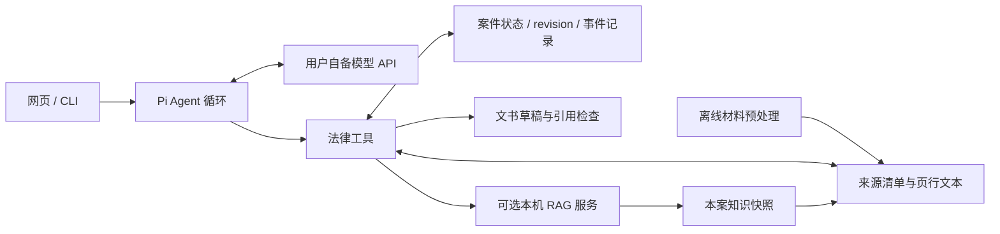

<div align="center">

# ⚖️ LegalAgent

### 从案卷到论证，再到可复核的文书草稿

**可追溯引用 · 六阶段办案流程 · 持久案件记录 · 流式网页对话**

[](LICENSE)
[](https://nodejs.org/)
[](https://github.com/lite93597/pi-legal-agent/actions/workflows/legal-agent.yml)
[](https://github.com/lite93597/pi-legal-agent/stargazers)

[快速开始](#快速开始) · [体验完整案件](#体验完整案件) · [架构与工具](#架构与工具) · [接入 RAG](docs/rag-contract.md) · [English](README.en.md)

</div>

LegalAgent 是基于 [Pi](https://github.com/earendil-works/pi) 扩展的中文法律 Agent。它通过模型与工具协作，读取案件材料、组织事实和争点、保存主备选方案，并起草供专业人员审阅的文书。

这个仓库开放 **Agent 实现与网页界面**，模型由你自行部署或接入。支持 OpenAI-compatible Chat Completions API；本地部署的 Qwen 等模型需要支持流式输出和工具调用。仓库不提供模型权重、训练数据、真实案卷或法律数据库。

## 你能用它做什么

| 能力 | 实现方式 |
| --- | --- |
| 从材料中回答，并找回出处 | 文件预处理生成来源 ID、页行定位；按段阅读、逐字核验引用 |
| 处理一个持续推进的案件 | 接案 → 证据 → 争点 → 方案 → 起草 → 审校；阶段推进检查实际产物 |
| 保留不同证据状态 | 区分材料记载、当事人陈述、模型推论和待核事项 |
| 刷新网页或新开对话后续办 | 聊天历史与案件工作记录分别持久化；案件摘要注入下一轮 |
| 看见 Agent 正在调用什么工具 | 网页流式输出、工具开始/结束、结果摘要、停止生成与草稿下载 |
| 接入自己的法律知识库 | 可选本机 RAG HTTP 服务；结果保存为带来源和元数据的案件快照 |
| 管理长对话和失败状态 | 中文上下文预算、摘要检查点、循环/超时约束；中断明确记录为未完成 |

## 快速开始

### 1. 安装

需要 **Node.js ≥ 22.19**、npm，以及 **Python ≥ 3.10**（用于导入材料）。TXT、Markdown、DOCX 预处理只依赖 Python 标准库；PDF 需要 `pypdf`。Agent 和网页不依赖 Python。

```sh
git clone https://github.com/lite93597/pi-legal-agent.git
cd pi-legal-agent
npm ci --ignore-scripts
```

本仓库保留了 Pi 的源码工作区，因此依赖安装包含上游运行库。法律入口直接运行 TypeScript 源码，无需先构建各工作区或下载模型。

### 2. 连接你自己的模型

假设你的 API 位于 `http://127.0.0.1:8000/v1`，`GET /v1/models` 返回模型 ID `legal-model`：

```sh
npm run legal:setup -- --base-url http://127.0.0.1:8000/v1 --model legal-model
```

设置 API 密钥。**本机服务不要求认证时使用占位值 `unused`**；有认证时替换为你的真实密钥，并保存在环境变量中。

```powershell
# Windows PowerShell
$env:LEGALAGENT_API_KEY = "unused"
```

```sh
# macOS / Linux
export LEGALAGENT_API_KEY=unused
```

初始化会生成 `.local/agent/models.json`、`settings.json` 和 `.local/demo-case/`。配置中的 `$LEGALAGENT_API_KEY` 是环境变量引用，不是密钥本身。已有配置和案例不会被默认初始化覆盖。

模型 API 可使用本机 HTTP 或 HTTPS 地址。请按服务的真实能力调整 `.local/agent/models.json` 中的 `contextWindow`、`maxTokens` 与兼容选项；默认 20,480/4,096 是模板值。**仅返回聊天文字的接口不足以运行完整 Agent**，还需要正确返回 `tool_calls`、消费工具结果，并提供 `/models` 接口。

### 3. 导入合成案例

```sh
python legal/intake/intake.py --case-dir .local/demo-case .local/demo-case/材料/01-合成合同.txt .local/demo-case/材料/02-合成付款记录.txt .local/demo-case/材料/03-合成往来记录.txt
```

这是完全合成的合同纠纷案例，包含付款、验收争议与缺少证明的费用主张。预处理不调用模型，也不修改原件；重复导入同一输出会拒绝覆盖。其他格式与定位规则见 [材料导入说明](legal/intake/README.md)。

### 4. 打开法律工作台

```sh
npm run legal:web
```

浏览器访问 **http://127.0.0.1:18005**，先发送：

> 请清点本案材料，明确任务范围，把材料记载、当事人陈述和待核事项分开保存；暂不认定违约责任。

默认保存案件工作记录与对话，**不启用文书保存工具**。需要保存草稿时使用：

```sh
npm run legal:web -- --allow-write
```

如果模型尚未启动，网页会显示连接失败；模型连接恢复后点击“重新检查连接”。未配置外部 RAG 时，本案材料检索仍可用。

<details>
<summary>使用自己的案件目录、CLI 或 PowerShell 入口</summary>

```sh
# 先在自己的案件目录导入材料，再启动；文件路径须位于该案件目录内。
python legal/intake/intake.py --case-dir cases/my-case cases/my-case/materials/contract.txt
npm run legal:web -- --case-dir cases/my-case --port 18005 --allow-write

# CLI 默认保存会话；--no-save-session 可关闭会话持久化。
npm run legal:cli -- --case-dir .local/demo-case --prompt "清点材料并列出证据缺口"

# 查看完整启动参数
npm run legal:web -- --help
npm run legal:cli -- --help
```

Windows 也可使用 `./legalweb.ps1` 和 `./legalagent.ps1`；它们调用同一套 Node 启动脚本。请自行保护案件目录，`.gitignore` 不能阻止你主动提交敏感材料。

</details>

## 体验完整案件

按下面的顺序与 Agent 对话，观察左侧阶段、待办与草稿如何更新。步骤依赖材料和模型实际响应，不保证每次都能自动完成。

1. **接案**：“以演示乙方的立场处理合同争议，限定中国大陆民事合同场景，先明确材料和缺口。”
2. **证据**：“建立付款和交付时间线，每条附来源；不要把甲方提出的 5,000 元费用当成已证实损失。”
3. **争点**：“分析验收与付款条件争议，保存支持和反对理由。没有取得的法条写为待核，不凭记忆编造引文。”
4. **方案**：“给出主方案与备选方案，写出成立条件、不利事实和需要补充的证据。”
5. **起草**：“检查阶段条件，起草一份沟通函；未知日期、金额依据和法律依据用占位或待核说明。”
6. **审校**：“核对草稿引用和遗漏，给出专业人员需要复核的清单。”

想检验续办能力，可点击“新对话”再问：“读取当前案件状态，说明已完成工作和下一步。”新对话保留案件记录，不自动继承全部旧聊天。没有开启 `--allow-write` 时，草稿可在对话中生成，但不会登记为已保存文书。

## 架构与工具



模型选择工具并提出操作，程序负责校验路径、参数、来源和阶段条件。六阶段是有条件的工作流，可依据补充材料回退或跳转；不在代码中写死罪名、刑期或案件结论。

| 工具 | 用途 |
| --- | --- |
| `legal_sources_list` | 枚举已导入材料 |
| `legal_source_read` | 按页行读取来源片段，支持长行续读与知识快照元数据 |
| `legal_citation_verify` | 核对逐字引文与来源定位 |
| `legal_retrieve` | 检索本案材料；或调用自备知识库，保存 `K_` 来源快照 |
| `legal_case_status` | 读取完整案件状态与 revision |
| `legal_case_update` | 保存范围、事实、争点、法律依据、方案和待办；使用 revision 防止过期覆盖 |
| `legal_case_advance` | 检查目标阶段需要的产物后推进 |
| `legal_draft_save` | 开启写入后保存新草稿，检查结构与引用，并登记待审阅文书 |

另有内置 `read` 工具。网页只允许读取当前案件目录和内置法律技能目录；不会加载案件目录中的任意扩展。CLI 保留 Pi 的运行方式和配置能力，不能把网页的路径限制视为 CLI 的隔离沙箱。

**引用格式示例：** `S001 [p0001:L0003]`。PDF 使用原 PDF 页码与提取文本行号，其他格式采用虚拟页 `p0001`。核验成功表示文字和定位相符，不证明材料真实、法条有效或法律论证正确。

## 接入自己的 RAG

本案材料检索使用本地处理后的文本，开箱可用。外部法规与案例检索是可选功能：

```powershell
$env:LEGAL_RAG_URL = "http://127.0.0.1:18020"
npm run legal:web
```

```sh
export LEGAL_RAG_URL=http://127.0.0.1:18020
npm run legal:web
```

适配器调用 `POST /search`，网页通过 `GET /health` 检查服务。仅允许本机 HTTP 根地址，拒绝重定向、URL 凭据和附加路径。检索结果保存到当前案件，并保留来源、版本、日期和出处信息；缺失元数据须继续核实。

**法律数据库、向量模型、FAISS 索引与 RAG 后端不随仓库发布。** 对接字段、大小限制及日期语义见 [RAG 接口契约](docs/rag-contract.md)。现有服务可按该契约编写适配层。

## 开发与验证

```sh
npm run legal:check
npm run legal:test
python -m unittest discover -s legal/intake -p "test_*.py" -v
```

定向回归覆盖来源读取/引文核验、RAG 边界与重定向、工作流推进与 revision 冲突、文书结构、上下文预算、会话恢复和路径约束。测试使用合成数据或受控 HTTP 响应，不消耗模型推理额度；不代表真实法律准确率评测。GitHub Actions 在 Linux 与 Windows 检查法律模块。

发布准备时（2026-10-09），在干净目录完成依赖安装、完整源码检查、**56 项 Agent 回归与 4 项材料预处理测试**。另以合成流式 API 验证动态模型名、认证、真实工具执行、网页事件输出与落盘对话恢复；这项接入验证不衡量模型的法律回答能力。

| 目录 | 内容 |
| --- | --- |
| `legal/extensions/` | 来源、RAG、工作流工具及参数校验 |
| `legal/workflow/` | 持久状态、阶段条件、草稿校验与检查点 |
| `legal/web/` | HTTP 服务、网页、流式事件与恢复机制 |
| `legal/intake/` | Python 离线材料预处理 |
| `legal/skills/`、`legal/prompts/` | 法律场景技能与任务模板 |
| `legal/config/` | 无密钥的模型与设置模板 |
| `examples/demo-case/` | 完全合成的合同争议示例 |
| `packages/` | Pi 源码工作区及依赖运行库 |

`.local/`、案件运行记录、会话、日志、输出和常见模型权重格式默认忽略。`packages/ai/src/providers/data/` 仅含上游公开模型目录元数据，不含模型权重。

## 适用范围

- 当前是本机单用户法律研究原型。网页监听 `127.0.0.1`，没有账号系统或多租户隔离，不应直接作为公网服务部署。
- 材料和记录落在本机；进入上下文的片段会发送到你配置的模型 API。使用远程 API 前需确认案件资料的使用范围。
- 不提供 OCR；复杂 PDF、扫描件及 DOCX 附件需要额外处理和人工核对。
- 阶段检查和文书校验保障流程结构，不保证法律判断、结果预测、量刑建议或文书可直接提交。产物需要结合原件、适用法律与专业判断复核。
- 本仓库没有公布模型排行榜或真实案件正确率；模型质量和知识库时效由使用者的部署决定。

## 参与与支持

欢迎用合成或充分脱敏的示例提交 Issue，说明输入、预期、实际表现和工具日志。可以从模型兼容适配、RAG 接口、证据定位或工作流改进开始，见 [贡献指南](CONTRIBUTING.md)。

如果这个项目对你有帮助，欢迎 **Star ⭐**，也欢迎分享你的适配方案。下载可使用 `git clone` 或 GitHub 的 **Code → Download ZIP**。

## 许可证与致谢

[MIT](LICENSE)。LegalAgent 基于 Mario Zechner 与贡献者开发的 [Pi](https://github.com/earendil-works/pi) 源码扩展，保留上游版权声明。这是独立衍生项目；法律 Agent 扩展与发布边界见 [NOTICE](NOTICE)。
